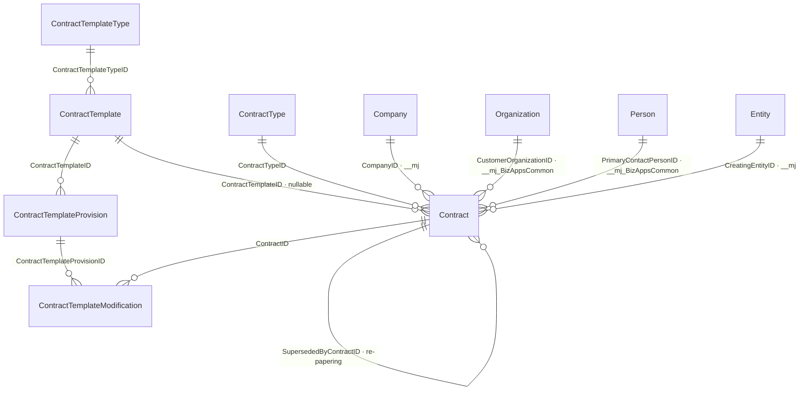

# `bizapps-contracts` — ERD (as built)

> **This is the AS-BUILT ERD — a reflection of the implementation, not a plan.** Intended-but-unbuilt
> schema changes belong in [`plans/ERD-planned.md`](../plans/ERD-planned.md), never here; this file
> must always describe what the database actually contains. The *reasoning* behind the shape — every
> decision, and the R-1…R-19 reversal log — lives there too. This file answers "what is there", that
> one answers "why".
>
> **GENERATED FROM THE LIVE SCHEMA.** Every table, column, nullability, foreign key, `CHECK` and
> unique index below was read out of `sys.tables` / `sys.columns` / `sys.foreign_keys` /
> `sys.check_constraints` / `sys.indexes` on a database built by `migrations/B202608040001…` through
> `V202608201000…`.
>
> **It is checked, not trusted.** `npx tsx test-harnesses/erd-schema-diff.ts` diffs this document
> against the live schema and exits non-zero on drift. Run it after any migration. The previous
> revision of this file described the **v1** schema for a day after v1 was retired, and nothing about
> reading it revealed that — which is why the check exists.

**6 tables** · 8 internal
> relationships · 4 cross-app foreign keys · 13 CHECK constraints · 6 unique indexes.

Schema: `__mj_BizAppsContracts`. Entity name prefix: `MJ_BizApps_Contracts: `.

---

## 1. The whole model

```mermaid
erDiagram
    ContractTemplateType {
        uuid ID PK
        nvarchar Name "unique"
        nvarchar Description "nullable"
        nvarchar Status "Active or Inactive"
    }

    ContractTemplate {
        uuid ID PK
        nvarchar Name "unique"
        uuid ContractTemplateTypeID FK "ContractTemplateType"
        nvarchar VersionLabel "nullable"
        date IntroducedDate "nullable"
        nvarchar SourceURL "where the text of this version lives"
        nvarchar Description "nullable"
        nvarchar Status "Draft or Published"
    }

    ContractTemplateProvision {
        uuid ID PK
        uuid ContractTemplateID FK "ContractTemplate"
        nvarchar ProvisionNumber "unique within the template"
        nvarchar Title "the clause heading"
        nvarchar ProvisionText "nvarchar-max · the standard clause · required, non-blank"
        nvarchar Description "nullable"
        nvarchar ProvisionSortKey "nullable · collatable key derived from ProvisionNumber · display order"
    }

    ContractType {
        uuid ID PK
        nvarchar Name "unique"
        nvarchar Description "nullable"
        bit RequiresExecutedDocument "drives IsAwaitingDocument"
        nvarchar Status "Active or Inactive"
        bit MustBeRoot "this type may not name a parent"
        bit MustBeChild "this type MUST name a parent · change orders"
        bit TemplateRequired "this type must cite a ContractTemplate"
    }

    Contract {
        uuid ID PK
        nvarchar ContractNumber "unique · CTR-nnnnnn · minted server-side"
        uuid ContractTypeID FK "ContractType"
        uuid CompanyID FK "__mj.Company · the SELLING entity"
        uuid CustomerOrganizationID FK "__mj_BizAppsCommon.Organization"
        uuid PrimaryContactPersonID FK "__mj_BizAppsCommon.Person · nullable"
        uuid ContractTemplateID FK "ContractTemplate · nullable"
        uuid CreatingEntityID FK "__mj.Entity · nullable"
        nvarchar CreatingRecordID "nvarchar450 · nullable · the Deal"
        uuid ParentContractID FK "self · nullable · change orders"
        uuid SupersededByContractID FK "self · nullable · re-papering"
        nvarchar SigningProviderURL "nullable · direct PandaDoc link"
        date EffectiveDate "nullable"
        date ExecutedDate "nullable"
        date EndDate "nullable"
        date TerminatedDate "nullable"
        bit AutoRenew "default 0"
        int RenewalNoticeDays "nullable"
        int CancellationWindowDays "nullable"
        decimal AnnualIncreasePercent "nullable"
        bit HasModifications "default 0 · monotonic"
        nvarchar Description "nullable"
        nvarchar Notes "nullable"
    }

    ContractTemplateModification {
        uuid ID PK
        uuid ContractID FK "Contract"
        uuid ContractTemplateProvisionID FK "ContractTemplateProvision"
        nvarchar ModificationText "nullable · nvarchar-max · what THIS contract says"
        nvarchar Notes "nullable"
    }
```

Every table also carries `__mj_CreatedAt` and `__mj_UpdatedAt` (`datetimeoffset`, defaulted and
trigger-maintained). CodeGen owns them; they are omitted from the diagrams so the real content is
readable.

## 2. The links

**8 internal foreign keys** (the first eight above) and **4 cross-app** (the last four). No FK leaves
this schema except those four, and none points into `bizapps-sales` — sales depends on contracts, so
the deal reference is the soft `CreatingEntityID` + `CreatingRecordID` pair rather than a hard FK.

`ContractNumber` is minted by `spAssignNextContractNumber` from the schema-owned SQL sequence
`seq_ContractNumber` (`NO CACHE`, so a restart cannot make the numbers jump). The `ContractSequence`
counter TABLE it replaced was dropped in `V202608200200` — a table was a full MJ entity, so anyone
with entity permission could rewrite or delete the counter; a sequence has no such surface.

## 3. Constraints

### 3.1 CHECK — 13

| Table | Constraint | Rule |
|---|---|---|
| `Contract` | `CK_Contract_Dates` | `EndDate >= EffectiveDate` when both are set |
| `Contract` | `CK_Contract_ParentNotSelf` | `ParentContractID <> ID` |
| `Contract` | `CK_Contract_SupersededNotSelf` | `SupersededByContractID <> ID` |
| `Contract` | `CK_Contract_CreatingPairBothOrNeither` | `CreatingEntityID` and `CreatingRecordID` are both set or both null |
| `Contract` | `CK_Contract_RenewalNoticeDays` | null or `>= 0` |
| `Contract` | `CK_Contract_CancellationWindow` | null or `>= 0` |
| `Contract` | `CK_Contract_AnnualIncrease` | null or `>= 0` |
| `ContractType` | `CK_ContractType_Status` | `IN ('Active','Inactive')` |
| `ContractType` | `CK_ContractType_RootOrChild` | `NOT (MustBeRoot = 1 AND MustBeChild = 1)` — a type cannot be both |
| `ContractTemplateType` | `CK_ContractTemplateType_Status` | `IN ('Active','Inactive')` |
| `ContractTemplate` | `CK_ContractTemplate_Status` | `IN ('Draft','Published')` |
| `ContractTemplateProvision` | `CK_ContractTemplateProvision_TextNotBlank` | `LEN(LTRIM(RTRIM(ProvisionText))) > 0` |
| `ContractTemplateModification` | `CK_ContractTemplateModification_TextNotBlank` | `LEN(LTRIM(RTRIM(ModificationText))) > 0` |

All seven `Contract` constraints have a **generated `Validate()` counterpart** on
`mjBizAppsContractsContractEntity`, and so do the two `TextNotBlank` constraints and
`CK_ContractType_RootOrChild`, so violating any of them produces a field-named message rather than a
raw SQL error.

The three `IN (…)` constraints do **not**: CodeGen renders those as `ValueListType='List'` metadata
(which drives the UI dropdown) rather than as validators, and `BaseEntity` does not validate value
lists — filed as [MJ#3969](https://github.com/MemberJunction/MJ/issues/3969).

### 3.2 Unique — 6

| Table | Index | Columns |
|---|---|---|
| `Contract` | `UQ_Contract_ContractNumber` | `ContractNumber` |
| `ContractTemplate` | `UQ_ContractTemplate_Name` | `Name` |
| `ContractTemplateProvision` | `UQ_ContractTemplateProvision_Template_Number` | `ContractTemplateID, ProvisionNumber` |
| `ContractTemplateModification` | `UQ_ContractTemplateModification_Contract_Provision` | `ContractID, ContractTemplateProvisionID` |
| `ContractType` | `UQ_ContractType_Name` | `Name` |
| `ContractTemplateType` | `UQ_ContractTemplateType_Name` | `Name` |

`UQ_ContractTemplateModification_Contract_Provision` is the one a user can reach by ordinary use: it
says a contract records **at most one** modification per provision.

### 3.3 Non-unique indexes

`IX_Contract_CreatingRecord` on `(CreatingEntityID, CreatingRecordID)` — the reverse lookup "which
contract came from this deal?". CodeGen additionally creates an `IDX_AUTO_MJ_FKEY_*` index on every
foreign key column.

## 4. Derived columns — not in any table

`vwContracts` is an **app-owned layered base view**: it wraps the CodeGen-generated
`vwContractsGenerated` and adds six columns that are computed at read time. They appear on the
`Contracts` entity as read-only fields, and they are the only place these facts exist.

| Column | Derived from |
|---|---|
| `State` | `TerminatedDate` / `SupersededByContractID` / `EndDate` / `EffectiveDate` / `ExecutedDate`, in that precedence — `Terminated`, `Superseded`, `Expired`, `Active`, `Executed`, `Draft` |
| `IsAwaitingDocument` | `ContractType.RequiresExecutedDocument` AND no `__mj.FileEntityRecordLink` row |
| `IsChangeOrder` | `ParentContractID IS NOT NULL` |
| `DaysToEnd` | `DATEDIFF(day, today, EndDate)` — signed |
| `RenewalNoticeDeadline` | `EndDate - RenewalNoticeDays` |
| `IsInCancellationWindow` | today falls within `CancellationWindowDays` of `EndDate` |

Three of them depend on **today**, so they cannot be stored: nothing writes the row when the clock
crosses a boundary. See `plans/ERD-planned.md` §7.2.

## 5. What this schema deliberately does not have

No `Status` column on `Contract` (derived as `State`), no named document FK (documents attach through
`__mj.FileEntityRecordLink`), no `ContractTemplateID` on a modification (its provision derives the
template), no line items, no billing schedule, no pricing, no commitment tracking and no amendment
workflow. The v1 schema had all of those across 10 tables; v2 is 7. `plans/ERD-planned.md` §9 records
each removal and who ruled it.
