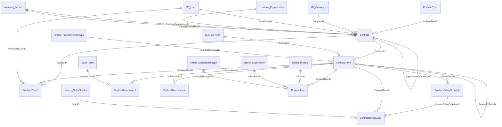
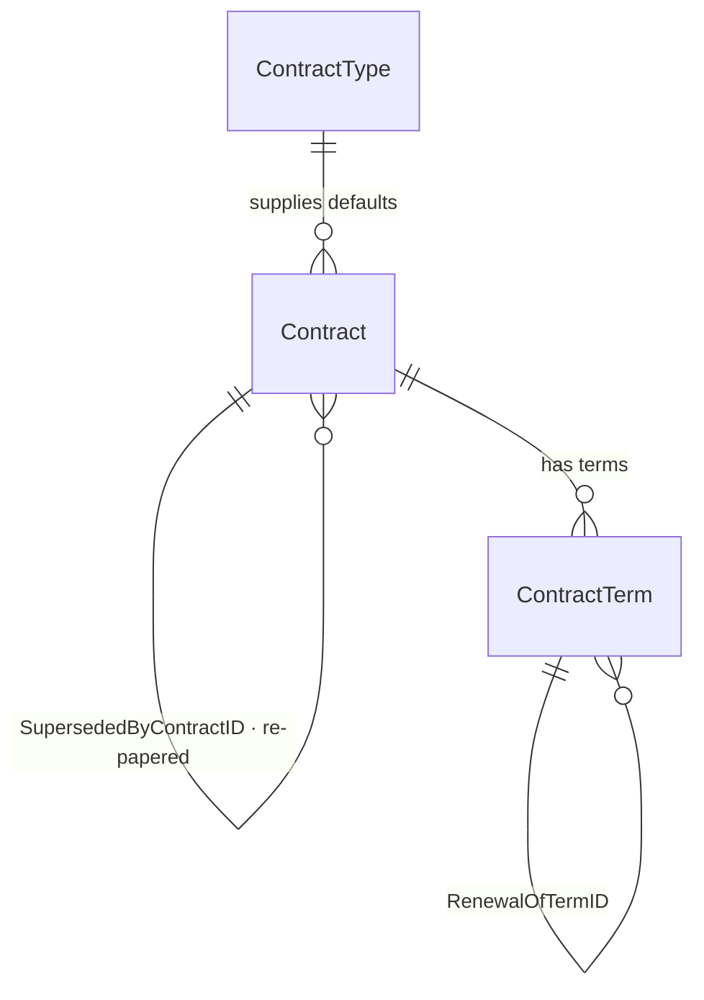
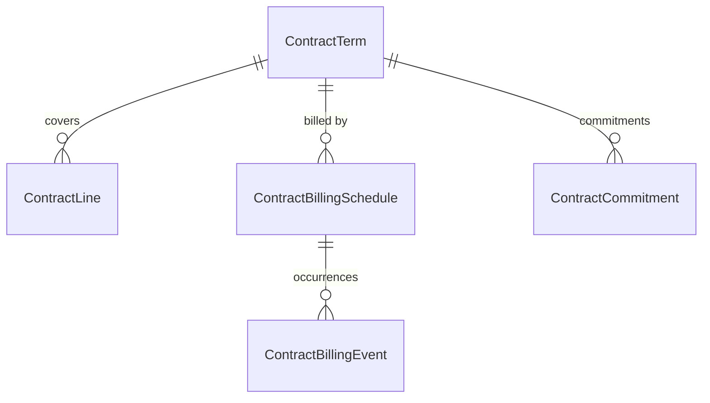
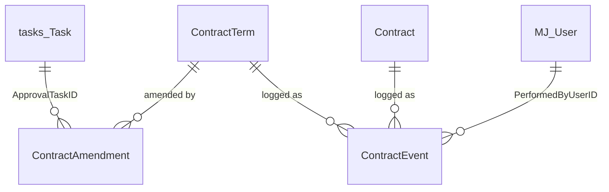

# `bizapps-contracts` — ERD

> **This is the AS-BUILT ERD — a reflection of the implementation, not a plan.** Intended-but-unbuilt
> schema changes belong in [`plans/ERD-planned.md`](../plans/ERD-planned.md), never here; this file
> must always describe what the database actually contains.
>
> **GENERATED FROM THE LIVE SCHEMA**, not from prose — every table, column, nullability and foreign
> key below was read out of `sys.tables`/`sys.foreign_keys` on a database built by
> `migrations/B202608040001…` + `V202608040002…`. Regenerate it after any migration change; do not
> hand-edit the diagrams.
>
> **Schema:** `__mj_BizAppsContracts` · **Entity prefix:** `MJ_BizApps_Contracts: ` · **Keys:** UUID throughout
> **Re-verified:** 2026-08-05 (afternoon) against the live database · **10 tables · 13 internal
> relationships · 13 cross-app foreign keys · 55 CHECK constraints · 6 unique indexes** beyond the
> primary keys.
>
> **The table shape below is UNCHANGED since the morning** — the afternoon's work added no migration,
> no table and no column. Every count above was read back out of `sys.tables`, `sys.columns`,
> `sys.foreign_keys`, `sys.check_constraints` and `sys.indexes` rather than taken on trust, and each
> table's column list here matches the live table exactly once the two CodeGen-managed audit columns
> (`__mj_CreatedAt`, `__mj_UpdatedAt`) are allowed for.
>
> (Ten is the app's own tables. `sys.tables` reports eleven in this schema because Flyway keeps its
> `flyway_schema_history` there; an earlier edit of this header counted it and said eleven, which was
> wrong — that table belongs to the migration tool, not to the model.)
>
> **What DID change on 2026-08-05 (afternoon) is where the rules live, not what the tables are.**
> Five entities that had CHECK constraints and no server subclass now have one, so the schema is no
> longer the only thing enforcing them — see **§7.2**, which replaces the two-line footnote this
> header used to carry. An ERD that shows only the tables now under-describes the model by a fair
> margin: read §7.1 and §7.2 together, because a constraint you cannot find in `sys.check_constraints`
> is not necessarily absent.

---

## 0. The two rules that explain most of this schema

**1 — Every reference is a real foreign key. There are no soft keys, ever.** Not a preference, a
mandate (Amith, 2026-08-04): *"No such thing as soft. Please eradicate the idea of a 'soft' key."*
The only acceptable non-FK reference in MJ is a genuine **polymorphic pair** (`EntityID` +
`RecordID`), used when the target entity is not knowable in advance. That is a typed polymorphic
link, not a soft key. Cross-app FKs are safe here because BizApps install in dependency order, so
`common`, `tasks`, `accounting` and `orders` are all present before this migration runs — and §4.A
of the baseline fails loudly if they are not, which is the dependency check.

**2 — Two things you would expect as columns are deliberately absent**, because MJ already models
them polymorphically and pointing *at* us:

| Not a column here | MJ's model | Why it is better |
|---|---|---|
| A document / `DocumentFileID` | `__mj.FileEntityRecordLink` (`EntityID` + `RecordID`) | One record carries the signed PDF *and* its exhibits *and* a countersigned amendment. A column caps it at one, and every future table that acquires paper needs its own. |
| A signature / envelope link | `__mj.SignatureRequest` (`EntityID` + `RecordID`) | Already carries `Status`, `SentAt`, `CompletedAt`, `VoidReason`, `ExternalEnvelopeID`, plus recipients, documents and logs — provider-agnostic across DocuSign, Dropbox Sign and PandaDoc. Costs us zero columns and zero migration. |

Both point **down** into this schema, so the dependency graph stays correct: MJ core references our
records; we add nothing to reference it.

---

## 1. Master map — every entity, every connection

**Reading the shape.** The spine is three deep — `Contract → ContractTerm → everything else`.
`ContractTerm` is the hub: six tables hang off it, because **the term is the unit the billing engine
operates on**, not the contract. Two self-references carry the two kinds of history: `RenewalOfTermID`
is *continuity* (this term renews that one) and `SupersededByContractID` is *rupture* (this contract
was replaced by new paper). `ContractSequence` stands alone — it is a singleton counter for
`CTR-{seq}`, not part of the graph.

**Deliberately absent: `Contract.DealID`.** One contract, many deals — the original sale is a deal and
every renewal is another — so a single column could only ever name one and would decay into
"whichever deal we wrote last." The link lives in `bizapps-sales` as `Deal.ContractID`, pointing down.

---

## 2. Full detail — every column, as built

```mermaid
erDiagram
    ContractType {
        uuid ID PK
        nvarchar Code
        nvarchar Name
        nvarchar Description "nullable"
        int DefaultTermMonths "nullable"
        nvarchar DefaultBillingFrequency "nullable"
        bit DefaultAutoRenew
        bit RequiresSignature
        decimal DefaultEscalationPercent "nullable"
        decimal DefaultMaxEscalationPercent "nullable"
        int DefaultRenewalNoticeDays "nullable"
        int DefaultCancellationWindowDays "nullable"
        nvarchar RenewalMode
        bit AllowsCoterm
        nvarchar DriverClass "nullable"
        bit IsActive
    }

    Contract {
        uuid ID PK
        nvarchar ContractNumber
        uuid ContractTypeID FK "ContractType"
        uuid CompanyID FK "__mj.Company"
        uuid CustomerOrganizationID FK "__mj_BizAppsCommon.Organization · nullable"
        uuid CustomerPersonID FK "__mj_BizAppsCommon.Person · nullable"
        uuid PrimaryContactPersonID FK "__mj_BizAppsCommon.Person · nullable"
        uuid OwnerUserID FK "__mj.User · nullable"
        uuid ParentContractID FK "self · nullable"
        uuid SupersededByContractID FK "self · nullable"
        nvarchar Status
        nvarchar Description "nullable"
        date EffectiveDate "nullable"
        date ExecutedDate "nullable"
        date PricedAt "nullable"
        bit AutoRenew
        int CancellationWindowDays "nullable"
        nvarchar TerminationPolicy "nullable"
        nvarchar ExternalReferenceID "nullable"
    }

    ContractTerm {
        uuid ID PK
        uuid ContractID FK "Contract"
        int TermNumber
        date StartDate
        date EndDate
        nvarchar Status
        uuid RenewalOfTermID FK "self · nullable"
        decimal CommittedAmount "nullable"
        decimal EscalationPercent "nullable"
        nvarchar EscalationBasis "nullable"
        decimal MaxEscalationPercent "nullable"
        int RenewalNoticeDays "nullable"
        nvarchar BillingFrequency
        tinyint BillingAnchorMonth "nullable"
        tinyint BillingAnchorDay "nullable"
        uuid PaymentTermsTypeID FK "__mj_BizAppsOrders.PaymentTermsType · nullable"
        uuid CurrencyID FK "__mj_BizAppsAccounting.Currency · nullable"
        date EarlyTerminationDate "nullable"
        decimal RenewalProbability "nullable"
        date ExecutedDate "nullable"
        nvarchar Notes "nullable"
    }

    ContractLine {
        uuid ID PK
        uuid ContractTermID FK "ContractTerm"
        uuid ProductID FK "__mj_BizAppsOrders.Product"
        nvarchar LineType
        decimal Quantity
        decimal ContractedUnitPrice "nullable"
        decimal DiscountPct "nullable"
        date StartDate "nullable"
        date EndDate "nullable"
        uuid SubscriptionTypeID FK "__mj_BizAppsOrders.SubscriptionType · nullable"
        uuid SubscriptionID FK "__mj_BizAppsOrders.Subscription · nullable"
        nvarchar Description "nullable"
        int DisplayOrder
    }

    ContractBillingSchedule {
        uuid ID PK
        uuid ContractTermID FK "ContractTerm"
        nvarchar ScheduleType
        nvarchar Frequency "nullable"
        date AnchorDate "nullable"
        bit IsActive
        nvarchar Notes "nullable"
    }

    ContractBillingEvent {
        uuid ID PK
        uuid ContractBillingScheduleID FK "ContractBillingSchedule · nullable"
        uuid ContractTermID FK "ContractTerm"
        date ScheduledDate
        nvarchar Status
        uuid OrderID FK "__mj_BizAppsOrders.OrderHeader · nullable"
        decimal ComputedAmount "nullable"
        datetime GeneratedAt "nullable"
        nvarchar FailureReason "nullable"
        nvarchar Notes "nullable"
    }

    ContractCommitment {
        uuid ID PK
        uuid ContractTermID FK "ContractTerm"
        nvarchar CommitmentType
        decimal CommittedAmount
        decimal ConsumedAmount
        date PeriodStart "nullable"
        date PeriodEnd "nullable"
        nvarchar TrueUpPolicy
        nvarchar Status
    }

    ContractAmendment {
        uuid ID PK
        uuid ContractTermID FK "ContractTerm"
        int AmendmentNumber
        date EffectiveDate
        nvarchar AmendmentType
        nvarchar Description "nullable"
        nvarchar Status
        uuid ApprovalTaskID FK "__mj_BizAppsTasks.Task · nullable"
    }

    ContractEvent {
        uuid ID PK
        uuid ContractID FK "Contract"
        uuid ContractTermID FK "ContractTerm · nullable"
        nvarchar EventType
        datetime EventDate
        nvarchar Payload "nullable"
        uuid PerformedByUserID FK "__mj.User · nullable"
    }

    ContractSequence {
        int ID PK
        int NextSequenceNumber
    }
```

---

## 3. Cross-app reference register

Every reference out of `__mj_BizAppsContracts`. **All are real foreign keys.** The direction rule
(orders D44) is that cross-app references point *up* the dependency graph — `common → tasks →
accounting → orders → contracts → sales` — so all of these are legal, and any reference into
`bizapps-sales` would not be.

| From | Column | To | App |
|---|---|---|---|
| `Contract` | `CompanyID` | `__mj.Company` | MJ core |
| `Contract` | `OwnerUserID` | `__mj.User` | MJ core |
| `Contract` | `CustomerOrganizationID` | `__mj_BizAppsCommon.Organization` | common |
| `Contract` | `CustomerPersonID` | `__mj_BizAppsCommon.Person` | common |
| `Contract` | `PrimaryContactPersonID` | `__mj_BizAppsCommon.Person` | common |
| `ContractTerm` | `PaymentTermsTypeID` | `__mj_BizAppsOrders.PaymentTermsType` | orders |
| `ContractTerm` | `CurrencyID` | `__mj_BizAppsAccounting.Currency` | accounting |
| `ContractLine` | `ProductID` | `__mj_BizAppsOrders.Product` | orders |
| `ContractLine` | `SubscriptionTypeID` | `__mj_BizAppsOrders.SubscriptionType` | orders |
| `ContractLine` | `SubscriptionID` | `__mj_BizAppsOrders.Subscription` | orders |
| `ContractBillingEvent` | `OrderID` | `__mj_BizAppsOrders.OrderHeader` | orders |
| `ContractAmendment` | `ApprovalTaskID` | `__mj_BizAppsTasks.Task` | tasks |
| `ContractEvent` | `PerformedByUserID` | `__mj.User` | MJ core |
| — | *(none, and never)* | `bizapps-sales.Deal` | 🚫 forbidden (L-15) |

**The two `ContractLine` subscription columns are not redundant.** `SubscriptionTypeID` is a
**decision** — which kind of subscription this line becomes, negotiated on the contract before
anything exists (and required, because `orders.Subscription.SubscriptionTypeID` is `NOT NULL`).
`SubscriptionID` is the **result** — the subscription the engine actually materialized. One is input,
one is output.

---

## 4. The agreement spine

`ContractType` is configuration-as-data: the columns *are* the rules and a base behaviour class reads
them; `DriverClass` is nullable and appears only when a customer needs something the columns cannot
express. Both the contract and the term carry an `ExecutedDate` and a `PendingSignature` status, which
is what lets one schema serve both the **evergreen** pattern (one signed document, many periods) and
the **re-papered** pattern (new paper per period) without a second model.

---

## 5. Coverage, billing and commitment

One term may carry **more than one schedule** — a quarterly subscription cadence *and* a milestone
schedule for the attached SOW — which is why it is a table rather than columns on the term.
`ContractBillingEvent` is the audit trail as much as the queue: it answers "why did the customer get
this bill on this date, and what produced it," and a failure stays `Failed` **with a reason** rather
than retrying into a duplicate.

**No amount on this side is computed here.** `ComputedAmount` is a *stamp* of what
`Orders.PreviewOrder` returned. Contracts decides *what* to bill and never *what it costs*.

---

## 6. Change, approval and history

**Amendments change a live term; renewals start a new one.** Conflating the two is the most common
contract-model mistake. `ContractEvent` is the immutable system record; customer-visible events also
write a `common.Activity` row so the agreement appears on the account timeline — two different things,
neither replacing the other.

---

## 7. Value lists (all CHECK-constrained)

| Entity | Column | Values |
|---|---|---|
| `Contract` | `Status` | `Draft` · `PendingSignature` · `Active` · `Expired` · `Terminated` · `Superseded` |
| `ContractTerm` | `Status` | `Pending` · `PendingSignature` · `Active` · `Completed` · `Terminated` |
| `ContractTerm` | `EscalationBasis` | `PriorTerm` · `ListPrice` · `Index` |
| `ContractTerm` | `BillingFrequency` | `Monthly` · `Quarterly` · `SemiAnnual` · `Annual` · `Milestone` · `Custom` |
| `ContractLine` | `LineType` | `Subscription` · `OneTime` · `Milestone` · `Usage` · `Minimum` |
| `ContractBillingSchedule` | `ScheduleType` | `Cadence` · `Milestone` · `Custom` |
| `ContractBillingEvent` | `Status` | `Scheduled` · `Generated` · `Skipped` · **`Cancelled`** · `Failed` |
| `ContractCommitment` | `CommitmentType` | `Minimum` · `Prepaid` · `Draw` |
| `ContractCommitment` | `TrueUpPolicy` | `BillShortfall` · `Forfeit` · `Rollover` |
| `ContractCommitment` | `Status` | `Open` · `Closed` · `TruedUp` · `Forfeited` |
| `ContractAmendment` | `AmendmentType` | `AddProduct` · `ChangeQuantity` · `ChangePrice` · `Coterm` · `PartialTerminate` · `Other` |
| `ContractAmendment` | `Status` | `Draft` · `PendingApproval` · `Approved` · `Rejected` · `Applied` · `Cancelled` |
| `ContractEvent` | `EventType` | `ContractCreated` · `ContractExecuted` · `ContractTerminated` · `ContractSuperseded` · `ContractExpired` · `SentForSignature` · `SignatureRejected` · `TermActivated` · `TermRenewed` · `TermCompleted` · `TermTerminated` · `AmendmentApplied` · `BillingEventGenerated` · `BillingEventFailed` |

`Usage` and `Index` are in their lists deliberately even though usage metering and index escalation
are out of v1 — keeping the **value** means the schema does not change when the capability arrives,
and adding no **column** until there is something real to read is the matching half of that rule.

**`Cancelled` is distinct from `Skipped`** on a billing event: `Skipped` is one occurrence that did
not bill, `Cancelled` is one killed because the agreement ended under it. Reusing `Skipped` would
make "we skipped March" and "the agreement ended in March" the same value.

**`ContractEvent.EventType` was the schema's only unconstrained value column** until 2026-08-05 —
`EventType = 'asdf'` saved. Naming the set immediately exposed a live split: the demo seed wrote
`TermRenewed` while the renewal operation wrote `Renewed`, for the same event. The prefix discipline
is deliberate: `Contract*` for what happens to the agreement, `Term*` for a period, `BillingEvent*`
for a scheduled bill, so the subject of an event is readable from its type alone.

### 7.1 Rules that are NOT value lists

Four state-implies-field CHECKs and one filtered unique index. Each says "this status OBLIGES that
column", which a value list cannot express:

| Constraint | Rule |
|---|---|
| `CK_Contract_SupersededHasSuccessor` | `Superseded` requires `SupersededByContractID` — the exact state that column was added to eliminate |
| `CK_ContractLine_SubscriptionNeedsType` | A `Subscription` line requires `SubscriptionTypeID`; without it the row saves and then fails at BILLING time on a live contract |
| `CK_ContractBillingEvent_GeneratedHasTimestamp` | `Generated` requires `GeneratedAt` |
| `CK_ContractAmendment_ApprovedHasTask` | `Approved` or `Rejected` requires `ApprovalTaskID` — an approval with no record is what the task integration exists to prevent |
| `UQ_ContractLine_Subscription` (filtered) | One `orders.Subscription` per line; two lines owning one is a duplicate-billing shape |

---

### 7.2 The rules that are NOT in the schema at all

**Read this section as part of the ERD, not as an appendix.** A reader who takes the tables above as
the whole model will conclude the database enforces everything, and it does not. As of 2026-08-05
**nine of the ten tables have a server subclass** — every one except `ContractSequence`, which is a
counter rather than a record with rules — and a material share of what makes a contract *correct*
lives there rather than in `sys.check_constraints`.

**Why anything lives outside the schema.** A CHECK constraint sees ONE ROW and no siblings. Three
kinds of rule are therefore unreachable from it:

1. **Two-column comparisons.** CodeGen derives a generated validation method name from a constraint's
   expression, and a constraint naming two columns makes it emit a call to a method it never defines
   — a build break in generated code that orders already hit. So the escalation cap cannot be a CHECK
   here even though it is single-row.
2. **Cross-row rules.** A CHECK cannot read the row a foreign key points at, so "coverage must sit
   inside its term" and "an amendment targets a RUNNING term" have nowhere to live in the schema.
3. **Rules about a whole collection.** "An Active contract needs at least one term" is a statement
   about rows that do not exist yet at insert time.

**And why the readable half matters even when the CHECK already exists.** A constraint reports itself
as `CK_ContractLine_SubscriptionNeedsType` — a symbol, in a database error, arriving at a UI that can
only render it verbatim. Several rules below are therefore MIRRORED in `Validate()` as sentences
while the CHECK stays exactly where it is as the un-bypassable floor. The mirror is not a
replacement: a rule living only in TypeScript is a rule that direct SQL walks straight past.

| Entity | Rule enforced in the entity layer | Why it cannot be a CHECK |
|---|---|---|
| `Contract` | Legal status MOVES (`Terminated → Active` refused; `Superseded` terminal) | `CK_Contract_Status` knows the legal SET, not transitions |
| `Contract` | `ContractNumber` allocated from `ContractSequence`; `PricedAt` defaulted | A read-modify-write, not a predicate |
| `Contract` | An **Active** contract must have at least one term | A statement about a collection |
| `ContractTerm` | `TermNumber` derived from the contract's existing terms | Requires reading siblings |
| `ContractTerm` | Escalation may not exceed its cap; a renewal CLAMPS rather than failing | Two-column comparison (see 1 above) |
| `ContractTerm` | A renewal chain may not cross contracts | Compares this row to the row it points at |
| `ContractTerm` | Unset ceiling/notice inherited from the contract TYPE on a new term | A lookup, and only for new records |
| `ContractTerm` | An **Active** term must have at least one coverage line | A statement about a collection |
| `ContractLine` | Coverage must sit inside its term's dates, both ends | Cross-row |
| `ContractLine` | A **closed** term gains no new coverage | Cross-row |
| `ContractLine` | The Subscription trio, said readably | Mirrors three CHECKs so the UI can show a sentence |
| `ContractBillingSchedule` | A schedule that has already BILLED is frozen | Compares this row to the existence of rows in another table |
| `ContractBillingSchedule` | The anchor must fall inside the term | Cross-row |
| `ContractCommitment` | A settled commitment is terminal — reopening would bill one shortfall twice | Transitions again |
| `ContractCommitment` | The period must sit inside the term | Cross-row |
| `ContractAmendment` | An amendment targets a term that is **RUNNING** | Cross-row, and the distinction the whole table exists for |
| `ContractAmendment` | `AmendmentNumber` derived per term | Requires reading siblings |
| `ContractType` | A type's default escalation must fit under its own default ceiling | Two-column comparison (see 1 above) |
| `ContractEvent` | Append-only — edit and delete both refused | CodeGen generates working `spUpdate`/`spDelete`, so the table's own "never edited" comment was documentation rather than a mechanism |

**Two mechanical traps worth knowing before adding to this layer**, both sprung in this package:

- A rule placed in `ValidateAsync()` without `DefaultSkipAsyncValidation = false` on the class is
  **dead code that reads as live**. It compiles, looks correct, and never runs.
- `BaseEntity._InnerSave` skips its whole body — validation included — when the record is not dirty
  (`baseEntity.ts:2531`). A save that only removes a CHILD touches no field on the parent, so the
  parent's cross-child rules never run unless it passes `IgnoreDirtyState`.

`testing.md` maps each rule above to the check that proves it.

---

### 7.3 The write API, and what a diagram cannot show

The tables say what CAN be stored. **Six remote operations** say what the app actually DOES, and two
of them are the reason several columns exist at all:

| Operation | What it does to the schema |
|---|---|
| `Contracts.SaveContract` | Writes a whole agreement — contract, terms, coverage, schedules, commitments — in ONE transaction. Removals are NAMED in the payload, never inferred from absence, because a client holding two of five terms would otherwise delete the other three. |
| `Contracts.ActivateTerm` | Turns a term Active AND creates its `ContractBillingSchedule` plus the `ContractBillingEvent` rows its cadence implies. A term marked Active with no schedule bills nothing. **Reads `ContractTerm.BillingAnchorMonth` / `BillingAnchorDay`** — until 2026-08-05 those two columns were written by `RenewTerm` and read by nothing at all. |
| `Contracts.RenewTerm` | Creates the next term with `RenewalOfTermID` set, clamping escalation to the ceiling. |
| `Contracts.TerminateContract` | Moves the contract and its live terms to Terminated and CANCELS future billing events while RETAINING those on or before the effective date — periods already covered are still owed. |
| `Contracts.AmendTerm` | Co-terming (plan §5.4): a `ContractAmendment` plus a `ContractLine` whose `EndDate` is the **TERM's**, so a mid-term product renews with everything else instead of acquiring its own clock. |
| `Contracts.GenerateBillingEvent` | Claims a `Scheduled` event, assembles what is owed for the period, and stamps `OrderID` / `ComputedAmount` / `GeneratedAt` together — which is what `CK_ContractBillingEvent_GeneratedHasOrder` and `_GeneratedHasTimestamp` exist to guarantee. |

**Three Explorer nav items** reach all of this: `ContractsSectionResource`,
`ContractsBillingSectionResource` and `ContractsSetupSectionResource`, each registered via
`@RegisterClass(BaseResourceComponent, …)` against a `DefaultNavItems` entry in
`metadata/applications/.contracts-application.json`. Billing is a peer of Contracts rather than a
page beneath it because the cross-contract questions — what will bill next month, who is behind on
what they committed to — are not answered by opening one agreement at a time.

**`ContractSequence` and `IX_ContractBillingEvent_Due` only make sense read against this table.** The
sequence exists because `ContractNumber` is allocated by a read-modify-write that must not interleave;
the index exists because the scheduled driver's only query is
`Status='Scheduled' AND ScheduledDate <= today`.

---

## 8. Deliberately considered and rejected

Recording these so they are not re-proposed:

| Rejected | Why |
|---|---|
| `ContractLine.ResolvedUnitPrice` / `ResolvedAt` | Orders owns product pricing and price history. Each generated bill **is** an order carrying the real price and date, already linked via `ContractBillingEvent.OrderID`. A second copy here has no authority and can only drift. |
| `ContractTerm.EscalationIndexCode` | A bare code names an index but nothing resolves it, so an `Index` basis still could not execute. Matches the `Usage` precedent: keep the value, add the column when the capability is real. |
| `DocumentFileID` (three tables) | Replaced by `__mj.FileEntityRecordLink` — see §0. |
| Renaming `DiscountPct` | It is a fraction (0–1) wearing a percent name, but orders uses the identical shape for `OrderLine.DiscountPct` and `SalesAuthority.MaxDiscountPct`. Family consistency beats local correctness. |
| `Contract.DealID` in any form | L-15 — direction *and* cardinality. |

**Known gap, not yet solved:** there is no `ContractLine → OrderLine` mapping, so deriving "what did
this line cost last term" means matching by `ProductID` within the term's orders — fine when a product
appears once, ambiguous when it does not. It belongs in the billing engine, not in a shadow price column.
