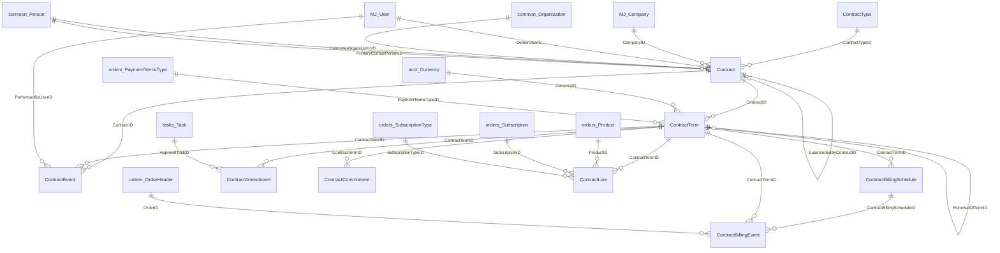
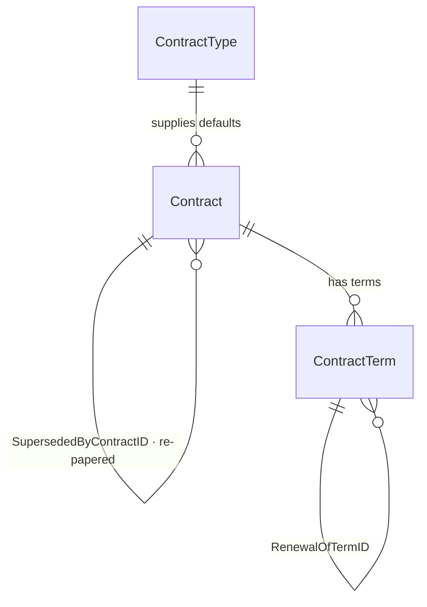
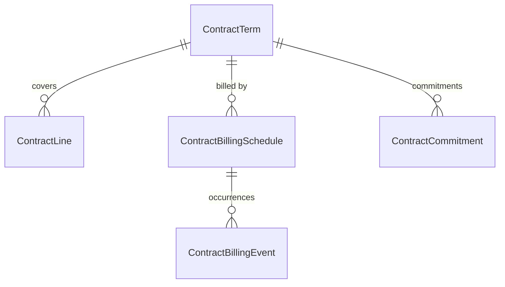
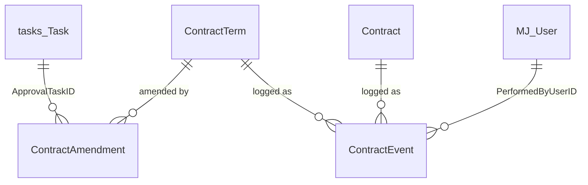

# `bizapps-contracts` — ERD

> **This is the AS-BUILT ERD — a reflection of the implementation, not a plan.** Intended-but-unbuilt
> schema changes belong in [`plans/ERD-planned.md`](../plans/ERD-planned.md), never here; this file
> must always describe what the database actually contains.
>
> **GENERATED FROM THE LIVE SCHEMA**, not from prose — every table, column, nullability and foreign
> key below was read out of `sys.tables`/`sys.foreign_keys` on a database built by
> `migrations/B202608040001…` + `V202608040002…`. Regenerate it after any migration change; do not
> hand-edit the diagrams.
>
> **Schema:** `__mj_BizAppsContracts` · **Entity prefix:** `MJ_BizApps_Contracts: ` · **Keys:** UUID throughout
> **Generated:** 2026-08-04 (re-generated after `Contract.PricedAt`) · 10 tables · 13 internal relationships · 13 cross-app foreign keys

---

## 0. The two rules that explain most of this schema

**1 — Every reference is a real foreign key. There are no soft keys, ever.** Not a preference, a
mandate (Amith, 2026-08-04): *"No such thing as soft. Please eradicate the idea of a 'soft' key."*
The only acceptable non-FK reference in MJ is a genuine **polymorphic pair** (`EntityID` +
`RecordID`), used when the target entity is not knowable in advance. That is a typed polymorphic
link, not a soft key. Cross-app FKs are safe here because BizApps install in dependency order, so
`common`, `tasks`, `accounting` and `orders` are all present before this migration runs — and §4.A
of the baseline fails loudly if they are not, which is the dependency check.

**2 — Two things you would expect as columns are deliberately absent**, because MJ already models
them polymorphically and pointing *at* us:

| Not a column here | MJ's model | Why it is better |
|---|---|---|
| A document / `DocumentFileID` | `__mj.FileEntityRecordLink` (`EntityID` + `RecordID`) | One record carries the signed PDF *and* its exhibits *and* a countersigned amendment. A column caps it at one, and every future table that acquires paper needs its own. |
| A signature / envelope link | `__mj.SignatureRequest` (`EntityID` + `RecordID`) | Already carries `Status`, `SentAt`, `CompletedAt`, `VoidReason`, `ExternalEnvelopeID`, plus recipients, documents and logs — provider-agnostic across DocuSign, Dropbox Sign and PandaDoc. Costs us zero columns and zero migration. |

Both point **down** into this schema, so the dependency graph stays correct: MJ core references our
records; we add nothing to reference it.

---

## 1. Master map — every entity, every connection

**Reading the shape.** The spine is three deep — `Contract → ContractTerm → everything else`.
`ContractTerm` is the hub: six tables hang off it, because **the term is the unit the billing engine
operates on**, not the contract. Two self-references carry the two kinds of history: `RenewalOfTermID`
is *continuity* (this term renews that one) and `SupersededByContractID` is *rupture* (this contract
was replaced by new paper). `ContractSequence` stands alone — it is a singleton counter for
`CTR-{seq}`, not part of the graph.

**Deliberately absent: `Contract.DealID`.** One contract, many deals — the original sale is a deal and
every renewal is another — so a single column could only ever name one and would decay into
"whichever deal we wrote last." The link lives in `bizapps-sales` as `Deal.ContractID`, pointing down.

---

## 2. Full detail — every column, as built

---

## 3. Cross-app reference register

Every reference out of `__mj_BizAppsContracts`. **All are real foreign keys.** The direction rule
(orders D44) is that cross-app references point *up* the dependency graph — `common → tasks →
accounting → orders → contracts → sales` — so all of these are legal, and any reference into
`bizapps-sales` would not be.

| From | Column | To | App |
|---|---|---|---|
| `Contract` | `CompanyID` | `__mj.Company` | MJ core |
| `Contract` | `OwnerUserID` | `__mj.User` | MJ core |
| `Contract` | `CustomerOrganizationID` | `__mj_BizAppsCommon.Organization` | common |
| `Contract` | `CustomerPersonID` | `__mj_BizAppsCommon.Person` | common |
| `Contract` | `PrimaryContactPersonID` | `__mj_BizAppsCommon.Person` | common |
| `ContractTerm` | `PaymentTermsTypeID` | `__mj_BizAppsOrders.PaymentTermsType` | orders |
| `ContractTerm` | `CurrencyID` | `__mj_BizAppsAccounting.Currency` | accounting |
| `ContractLine` | `ProductID` | `__mj_BizAppsOrders.Product` | orders |
| `ContractLine` | `SubscriptionTypeID` | `__mj_BizAppsOrders.SubscriptionType` | orders |
| `ContractLine` | `SubscriptionID` | `__mj_BizAppsOrders.Subscription` | orders |
| `ContractBillingEvent` | `OrderID` | `__mj_BizAppsOrders.OrderHeader` | orders |
| `ContractAmendment` | `ApprovalTaskID` | `__mj_BizAppsTasks.Task` | tasks |
| `ContractEvent` | `PerformedByUserID` | `__mj.User` | MJ core |
| — | *(none, and never)* | `bizapps-sales.Deal` | 🚫 forbidden (L-15) |

**The two `ContractLine` subscription columns are not redundant.** `SubscriptionTypeID` is a
**decision** — which kind of subscription this line becomes, negotiated on the contract before
anything exists (and required, because `orders.Subscription.SubscriptionTypeID` is `NOT NULL`).
`SubscriptionID` is the **result** — the subscription the engine actually materialized. One is input,
one is output.

---

## 4. The agreement spine

`ContractType` is configuration-as-data: the columns *are* the rules and a base behaviour class reads
them; `DriverClass` is nullable and appears only when a customer needs something the columns cannot
express. Both the contract and the term carry an `ExecutedDate` and a `PendingSignature` status, which
is what lets one schema serve both the **evergreen** pattern (one signed document, many periods) and
the **re-papered** pattern (new paper per period) without a second model.

---

## 5. Coverage, billing and commitment

One term may carry **more than one schedule** — a quarterly subscription cadence *and* a milestone
schedule for the attached SOW — which is why it is a table rather than columns on the term.
`ContractBillingEvent` is the audit trail as much as the queue: it answers "why did the customer get
this bill on this date, and what produced it," and a failure stays `Failed` **with a reason** rather
than retrying into a duplicate.

**No amount on this side is computed here.** `ComputedAmount` is a *stamp* of what
`Orders.PreviewOrder` returned. Contracts decides *what* to bill and never *what it costs*.

---

## 6. Change, approval and history

**Amendments change a live term; renewals start a new one.** Conflating the two is the most common
contract-model mistake. `ContractEvent` is the immutable system record; customer-visible events also
write a `common.Activity` row so the agreement appears on the account timeline — two different things,
neither replacing the other.

---

## 7. Value lists (all CHECK-constrained)

| Entity | Column | Values |
|---|---|---|
| `Contract` | `Status` | `Draft` · `PendingSignature` · `Active` · `Expired` · `Terminated` · `Superseded` |
| `ContractTerm` | `Status` | `Pending` · `PendingSignature` · `Active` · `Completed` · `Terminated` |
| `ContractTerm` | `EscalationBasis` | `PriorTerm` · `ListPrice` · `Index` |
| `ContractTerm` | `BillingFrequency` | `Monthly` · `Quarterly` · `SemiAnnual` · `Annual` · `Milestone` · `Custom` |
| `ContractLine` | `LineType` | `Subscription` · `OneTime` · `Milestone` · `Usage` · `Minimum` |
| `ContractBillingSchedule` | `ScheduleType` | `Cadence` · `Milestone` · `Custom` |
| `ContractBillingEvent` | `Status` | `Scheduled` · `Generated` · `Skipped` · `Failed` |
| `ContractCommitment` | `CommitmentType` | `Minimum` · `Prepaid` · `Draw` |
| `ContractCommitment` | `TrueUpPolicy` | `BillShortfall` · `Forfeit` · `Rollover` |
| `ContractCommitment` | `Status` | `Open` · `Closed` · `TruedUp` · `Forfeited` |
| `ContractAmendment` | `AmendmentType` | `AddProduct` · `ChangeQuantity` · `ChangePrice` · `Coterm` · `PartialTerminate` · `Other` |
| `ContractAmendment` | `Status` | `Draft` · `PendingApproval` · `Approved` · `Rejected` · `Applied` · `Cancelled` |

`Usage` and `Index` are in their lists deliberately even though usage metering and index escalation
are out of v1 — keeping the **value** means the schema does not change when the capability arrives,
and adding no **column** until there is something real to read is the matching half of that rule.

---

## 8. Deliberately considered and rejected

Recording these so they are not re-proposed:

| Rejected | Why |
|---|---|
| `ContractLine.ResolvedUnitPrice` / `ResolvedAt` | Orders owns product pricing and price history. Each generated bill **is** an order carrying the real price and date, already linked via `ContractBillingEvent.OrderID`. A second copy here has no authority and can only drift. |
| `ContractTerm.EscalationIndexCode` | A bare code names an index but nothing resolves it, so an `Index` basis still could not execute. Matches the `Usage` precedent: keep the value, add the column when the capability is real. |
| `DocumentFileID` (three tables) | Replaced by `__mj.FileEntityRecordLink` — see §0. |
| Renaming `DiscountPct` | It is a fraction (0–1) wearing a percent name, but orders uses the identical shape for `OrderLine.DiscountPct` and `SalesAuthority.MaxDiscountPct`. Family consistency beats local correctness. |
| `Contract.DealID` in any form | L-15 — direction *and* cardinality. |

**Known gap, not yet solved:** there is no `ContractLine → OrderLine` mapping, so deriving "what did
this line cost last term" means matching by `ProductID` within the term's orders — fine when a product
appears once, ambiguous when it does not. It belongs in the billing engine, not in a shadow price column.
