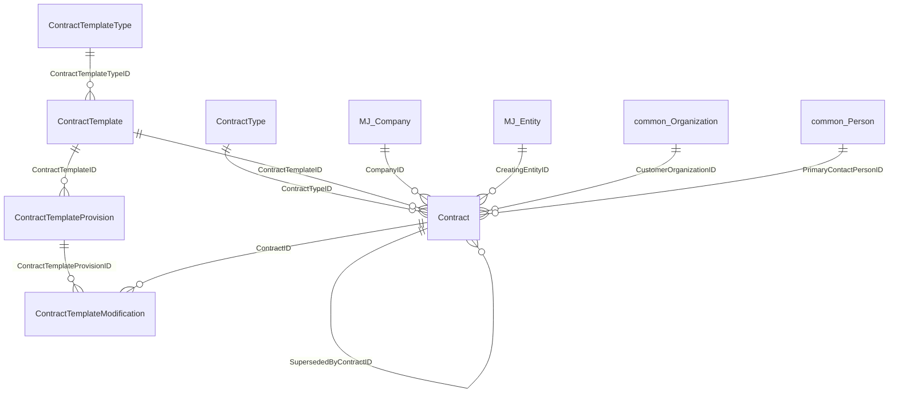
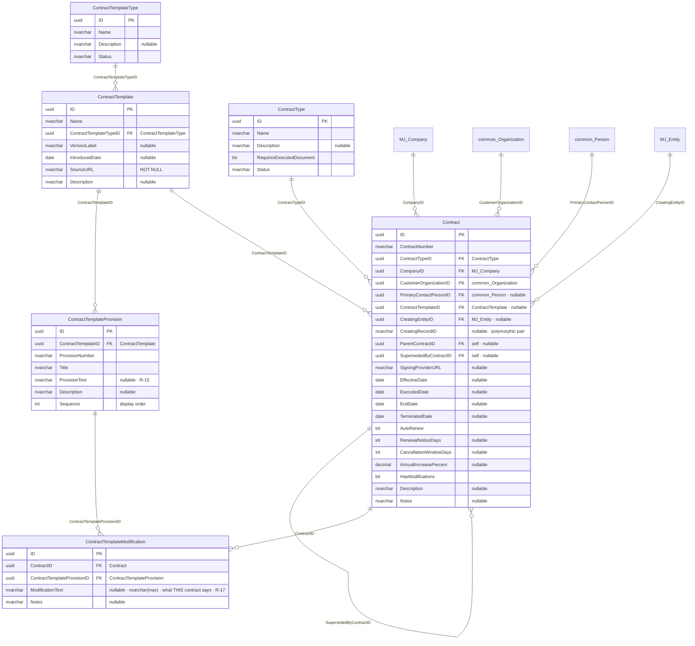
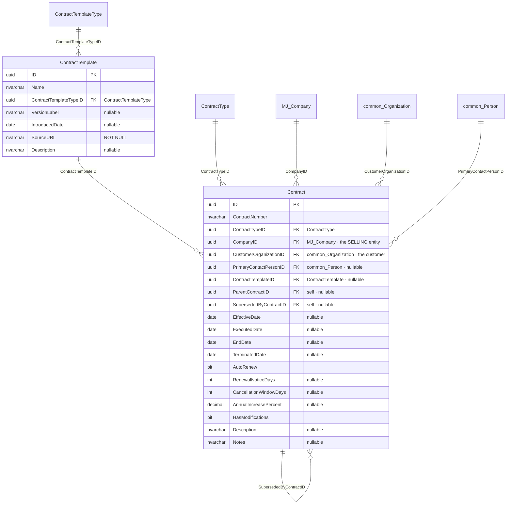
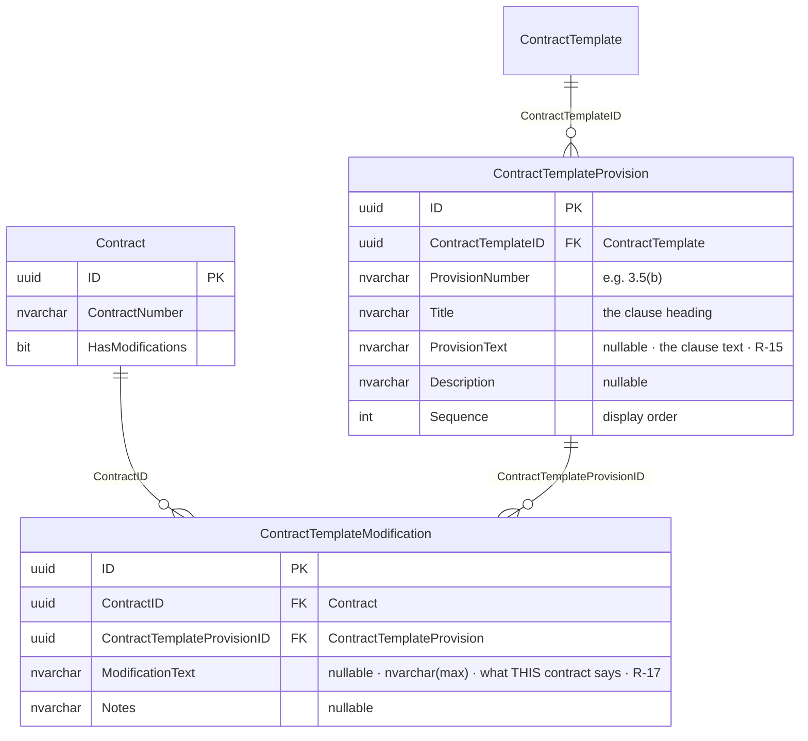
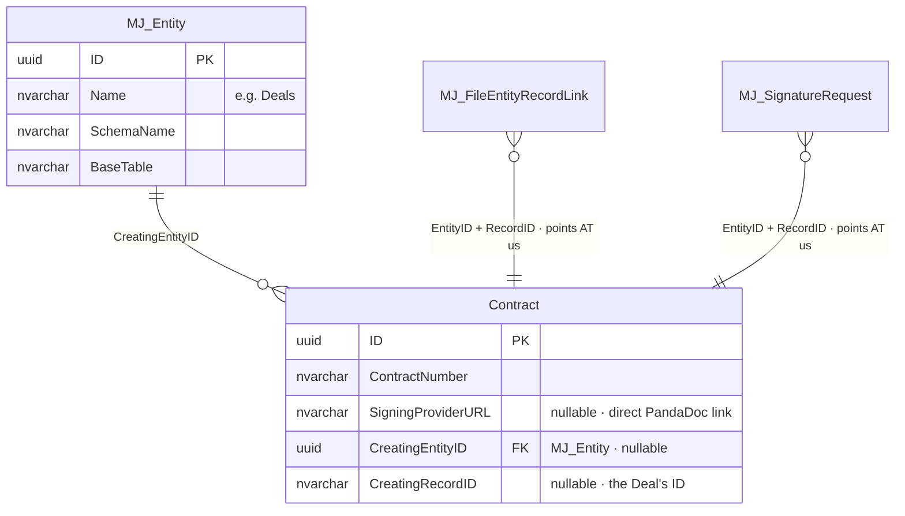

# `bizapps-contracts` — ERD (planned schema)

> **This is the schema to BUILD. Nothing here exists yet.** The v1 schema (10 tables,
> `migrations/B202608040001`) is **retired in full** — a clean-sheet replacement, per Amith's direction
> in the 2026-08-16 planning meeting: *"throw away everything that's in there, let's start from scratch,
> this is a clean sheet design."*
>
> `docs/ERD.md` still describes the **v1 database as built** and stays untouched until the new migration
> lands, at which point it is regenerated from `sys.tables`.
>
> **Companion:** [`bizapps-contracts-master.md`](./bizapps-contracts-master.md) is the master plan.
> Platform capabilities this design leans on: [`mj-storage-and-esignature-notes.md`](./mj-storage-and-esignature-notes.md).
>
> **Schema:** `__mj_BizAppsContracts` · **Entity prefix:** `MJ_BizApps_Contracts: ` · **Keys:** UUID throughout
> **7 tables · 8 internal relationships · 4 cross-app foreign keys · 1 polymorphic pair**
> **3 derived columns** on the app-owned layered base view: `State`, `IsAwaitingDocument`, `IsChangeOrder` (§4.5)
>
> **Sources, in order of authority:** Amith's rulings relayed in chat via Marcelo (2026-08-18 — R-15,
> R-16) → Amith's written review (2026-08-18) → the 2026-08-18 meeting notes → the planning-meeting
> transcript (*Contracts App Convo*, 2026-08-16). Where a later ruling reverses an earlier one, §9
> records it rather than hiding it.
>
> **How to read this.** §1 master map (names + connections). §2 every column, no lines. §2.1 every column
> WITH every line. §4–§6 the per-area diagrams to work from. §7 value lists and the rules no diagram
> carries. §8–§9 what was rejected, and what was reversed.

---

## 0. The four rules that explain this schema

**1 — Every reference is a real foreign key. There are no soft keys.** Amith's standing mandate: *"No
such thing as soft. Please eradicate the idea of a 'soft' key."* The one sanctioned exception, used once
here (§6.2), is a genuine **polymorphic pair** — a real FK to `__mj.Entity` plus a record id — *"a typed
polymorphic link, not a soft key."*

**2 — The dependency direction forbids a hard reference to a Deal.** References point *up* the graph —
`common → tasks → accounting → orders → contracts → sales`. Sales creates contracts, so sales depends on
contracts, and contracts may **never** hard-FK into `bizapps-sales`.

**3 — Structured obligations are COLUMNS. Textual deviations are MODIFICATION ROWS.** This is the
principle behind the 2026-08-18 removal of `TerminationPolicy`: anything we filter, sort or report on
(auto-renew, notice days, annual increase) earns a column; anything that is *"simply one of the
provisions in a contract"* is a row in `ContractTemplateModification` instead. Apply this test to every
future field request.

**4 — Documents, signatures and audit are MJ's, not ours.** Three things you would expect as columns are
absent because MJ models them and points *at* us:

| Not a column here | MJ's model |
|---|---|
| The executed PDF and every other document | `__mj.FileEntityRecordLink` (`EntityID` + `RecordID`) |
| Signature lifecycle | `__mj.SignatureRequest` — provider-agnostic across DocuSign, Dropbox Sign and **PandaDoc** |
| Who changed what, when | `__mj.RecordChange` |

There is **no exception** to rule 4. An earlier draft carried a named `ExecutedDocumentFileID` FK
alongside the link table; that was removed on 2026-08-18 (§9).

---

## 1. Master map — every entity, every connection

**Reading the shape.** Two records carry the app: `Contract` and `ContractTemplate`.
`ContractTemplateProvision` is the numbered clause list of a template version, and
`ContractTemplateModification` is the join that says *"this contract changed that provision."* In v1 the
hub was `ContractTerm` with six tables hanging off it, because the term was the unit a billing engine
operated on. There is no billing engine, so there is no hub.

**Three different relationships between contracts, and only two need a column:**

| Relationship | Mechanism | Meaning |
|---|---|---|
| **Change order** | `ParentContractID` | An addition that leaves the original **in force**. Its own deal, its own paper. *"There can be child contracts that are change orders, or derivatives."* |
| **Re-papering** | `SupersededByContractID` | New paper **replaces** the old; the predecessor's `Status` becomes `Superseded` |
| **Renewal** | *(no column)* | The old contract simply `Expired` and the next one exists for the same organisation |

**Why a change order is a `Contract` and not its own entity.** It *is* signed paper — its own execution
and effective dates, its own modifications, its own deal, its own contract number. That is every column
`Contract` has, so a separate entity would duplicate all of them plus its own numbering and screens. The
discriminator is `ContractType = 'Change Order'` **and** `ParentContractID IS NOT NULL` (a server-side
rule, not a `CHECK` — it needs a join to the type table). The cost is one filter: "top-level contracts"
means `ParentContractID IS NULL`.

**A grouping construct above `Contract` was declined** in the meeting: *"there could be a grouping
construct above the contract that could be interesting, but I think for now, the contract kind of is that
grouping"* — because contracts hang off the customer organisation.

`ContractSequence` stands alone — a singleton counter for `CTR-{seq}`, the shape orders uses for `ORD-`.

---

## 2. Full detail — every column

Columns only, no relationship lines. **§2.1 is the same tables with every connection drawn.**

```mermaid
erDiagram
    ContractTemplateType {
        uuid ID PK
        nvarchar Name
        nvarchar Description "nullable"
        nvarchar Status
    }

    ContractTemplate {
        uuid ID PK
        nvarchar Name
        uuid ContractTemplateTypeID FK "ContractTemplateType"
        nvarchar VersionLabel "nullable"
        date IntroducedDate "nullable"
        nvarchar SourceURL "NOT NULL"
        nvarchar Description "nullable"
    }

    ContractTemplateProvision {
        uuid ID PK
        uuid ContractTemplateID FK "ContractTemplate"
        nvarchar ProvisionNumber "e.g. 3.5(b)"
        nvarchar Title "the clause heading"
        nvarchar ProvisionText "nullable · nvarchar(max) · the clause text · R-15"
        nvarchar Description "nullable"
        int Sequence "display order"
    }

    ContractType {
        uuid ID PK
        nvarchar Name
        nvarchar Description "nullable"
        bit RequiresExecutedDocument
        nvarchar Status
    }

    Contract {
        uuid ID PK
        nvarchar ContractNumber
        uuid ContractTypeID FK "ContractType"
        uuid CompanyID FK "__mj.Company · the SELLING entity"
        uuid CustomerOrganizationID FK "__mj_BizAppsCommon.Organization"
        uuid PrimaryContactPersonID FK "__mj_BizAppsCommon.Person · nullable"
        uuid ContractTemplateID FK "ContractTemplate · nullable"
        uuid CreatingEntityID FK "__mj.Entity · nullable"
        nvarchar CreatingRecordID "nvarchar450 · nullable · the Deal"
        uuid ParentContractID FK "self · nullable · change orders"
        uuid SupersededByContractID FK "self · nullable"
        nvarchar SigningProviderURL "nullable"
        date EffectiveDate "nullable"
        date ExecutedDate "nullable"
        date EndDate "nullable"
        date TerminatedDate "nullable"
        bit AutoRenew
        int RenewalNoticeDays "nullable"
        int CancellationWindowDays "nullable"
        decimal AnnualIncreasePercent "nullable"
        bit HasModifications
        nvarchar Description "nullable"
        nvarchar Notes "nullable"
    }

    ContractTemplateModification {
        uuid ID PK
        uuid ContractID FK "Contract"
        uuid ContractTemplateProvisionID FK "ContractTemplateProvision"
        nvarchar ModificationText "nullable · nvarchar(max) · what THIS contract says · R-17"
        nvarchar Notes "nullable"
    }

    ContractSequence {
        int ID PK "singleton, always 1"
        int NextSequenceNumber
    }
```

---

## 2.1 Full detail **with links** — every column AND every connection

*(`ContractSequence` is omitted here only because it connects to nothing; its columns are in §2.)*

---

## 3. Cross-app reference register

| From | Column | To | App |
|---|---|---|---|
| `Contract` | `CompanyID` | `__mj.Company` | MJ core |
| `Contract` | `CustomerOrganizationID` | `__mj_BizAppsCommon.Organization` | common |
| `Contract` | `PrimaryContactPersonID` | `__mj_BizAppsCommon.Person` | common |
| `Contract` | `CreatingEntityID` | `__mj.Entity` | MJ core |
| `Contract` | `CreatingRecordID` | *(polymorphic — the deal)* | ⚠ typed pair, not an FK |
| — | *(none, and never)* | `bizapps-sales.Deal` | 🚫 forbidden — rule 2 |

**Four cross-app foreign keys, down from thirteen in v1.** Everything pointing at orders left with
`ContractLine` and `ContractBillingEvent`; accounting's `Currency` left with `ContractTerm`; tasks' `Task`
left with `ContractAmendment`; and `__mj.File` left with `ExecutedDocumentFileID` (§9).

> **Open item for the build:** `mj-app.json` still declares `tasks`, `accounting` and `orders`. With no
> foreign key to any of them remaining, that list should shrink to `mj-bizapps-common`.

---

## 4. The agreement spine

### 4.1 `ContractTemplate` — the standard paper

One *version* of a standard agreement. In practice the Master Agreement, published at a **date-versioned
public URL that never goes away**, so a customer who signed in June 2026 stays bound to the June 2026
text.

| Column | Rule |
|---|---|
| `SourceURL` | **`NOT NULL`.** Every template we have is a published, dated URL — that is the whole mechanism the meeting described, and it is what the executed PDF cites. Joanna: *"from the record standpoint, we just need that URL."* |
| `VersionLabel` | The version the document names itself, e.g. *"v6"* |
| `IntroducedDate` | When this version started being offered. **Not** an effective date — a template becomes effective for a customer *when that customer signs it* |

**Statements of work are out of scope for v1.** Amith (2026-08-18): *"SOWs have some standard language,
but we don't have a versioned template right now, that will change for sure as we scale PS."* The
`Statement of Work` template type is seeded so the door is open; no SOW template rows are created.

### 4.2 `Contract` — the signed agreement

**`CompanyID` and `CustomerOrganizationID` are different things and both are needed.** `__mj.Company` is
*our* legal entity — which Blue Cypress company holds the agreement. `Organization` is the customer.
`CompanyID` is not reliably derivable from the deal, which is why it is stored.

**`CustomerOrganizationID` is `NOT NULL` and there is no `CustomerPersonID`.** v1 allowed either in an
XOR; the meeting put the individual case entirely in orders — *"the contract layer is much more the B2B
scenario, not B2C."* A sole proprietor is representable as an `Organization`.

**Nothing about a document is required to create a contract** (2026-08-18: *"don't force users to have
the file to create a contract"*). A contract can be created, saved and worked with no document attached;
the document requirement is advisory only (§7.1).

### 4.3 The obligations, and why they live here

The v1 `ContractTerm` **table** is gone — a term table exists to drive billing periods, and billing moved
to subscriptions. The *facts* stay, and Amith confirmed the split on 2026-08-18:

> *"Contracts will hold renewal terms, increases, auto-renew or not. Subscriptions within the
> bizapps-orders system will not know about these things… for now orders/subs will assume auto-renewal for
> everything until a sub is cancelled. When a sub renews via the normal orders pathway, price is
> calculated based on then-current pricing rules for the given product."*

So the division is explicit: **contracts records the obligation, orders renews on its own default rules,
and finance reconciles the difference by hand.** Amith: *"It's no worse than current on that front as
everything is manual right now."*

**Verified against orders (`origin/next`):** `Subscription` / `SubscriptionType` carry `AutoRenew`,
`RenewalLeadDays`, `CancellationMode`, `CancellationWindowDays` and `GracePeriodDays`, and **no escalation
concept of any kind.** `AnnualIncreasePercent` exists in no other system.

These columns land on `Contract` rather than in a child table because **a renewal produces a new
contract, not a new term row**. Multi-term history is contract succession.

**Where a name is shared with orders** (`AutoRenew`, `CancellationWindowDays`), the two record different
facts: the contract states **what the paper says** — fixed for that agreement's life — while the
subscription is **an operational setting** someone can change next March. The UI should label the
contract block *"as stated in the agreement."*

**Future phase, recorded now so it is not re-litigated:** contracts may eventually **override renewal
pricing on a per-product basis**, which would mean a new child table keyed on contract + product. Amith
ruled it out of scope for v1. See §10.

### 4.4 `HasModifications` — a flag with one enforced direction

Set by the salesperson on the deal and correctable by finance. Its job is to answer *"did this customer
negotiate anything — do I need to read the PDF?"* **before** anyone has recorded the modifications, which
is why it is asserted rather than derived: a derived flag would read `false` for every contract nobody has
processed yet.

**One direction is enforced.** If any `ContractTemplateModification` rows exist the flag **must** be true —
a recorded modification is proof of one. Monotonic: evidence can raise the flag, never lower it.

| State | Verdict |
|---|---|
| modifications exist, flag true | valid |
| modifications exist, flag false | **rejected** |
| no modifications, flag true | **valid** — flagged by sales, not yet recorded |
| no modifications, flag false | valid |

This is an **integrity invariant inside one aggregate**, not a derivation and not a separation-of-concerns
problem: both inputs assert the same single fact — *this is not our standard paper.* It is a **cross-row**
rule, which a T-SQL `CHECK` cannot see, so it lives in the **server-side entity subclasses**: saving a
modification forces the parent flag true; clearing the flag is rejected while modifications exist.

### 4.5 There is no `Status` column — lifecycle is derived (R-18)

An earlier draft stored `Status` as `Draft · Active · Expired · Terminated · Superseded`. **It is gone.**
Four of those five values are projections of facts the row already holds, so a stored copy could only
agree or lie — precisely what §7.2 forbids:

| Value | Derived from |
|---|---|
| `Terminated` | `TerminatedDate IS NOT NULL` |
| `Superseded` | `SupersededByContractID IS NOT NULL` |
| `Expired` | `EndDate < today` |
| `Active` | none of the above, and `EffectiveDate <= today` |
| `Draft` | *was the only stored fact* — and it means "a person has not finished with this", which is the **finance task**, not a property of the agreement |

So the layered base view (§7.2) exposes **`State`**, computed in that precedence order. Consumers filter
and chip on it exactly as they would a column.

**Two consequences worth stating, because they are easy to miss:**

1. **The old `CK_Contract_SupersededHasSuccessor` constraint disappears with it.** It read
   `Status <> 'Superseded' OR SupersededByContractID IS NOT NULL` — with the status derived *from* the
   successor FK, the constraint becomes a tautology. Nothing is lost: a contract is superseded exactly
   when it names a successor.
2. **"Awaiting the document" was never a status value and is not a column either.** The only stored bit
   is `ContractType.RequiresExecutedDocument` — the *type* says whether paper is ever expected — and
   `IsAwaitingDocument` is derived in the same view as *requires it **and** no linked file*. A Payment
   Link contract therefore never reports as waiting, which is the whole reason this was never a status.

---

## 5. Modifications — the provision list and the join

### 5.1 `ContractTemplateProvision` — the clause list

The numbered provisions of a template version. Amith described it in the meeting and required it in
review: *"a structured TypeID fkey to a new ContractTemplateProvision that would have a simple list of all
the provisions that exist in our contract so we can categorize things easily."*

- **It hangs off `ContractTemplate`, not off nothing.** Provision numbering belongs to a *version* — the
  moment v7 renumbers, a single global list is wrong.
- `ProvisionNumber` (`3.5(b)`) + `Title` (the heading) are what a person picks from. `UNIQUE(ContractTemplateID, ProvisionNumber)`.
- `Sequence` exists because `ProvisionNumber` does not sort as text (`3.10` before `3.5`), and a legal
  document has a canonical order.
- **`ProvisionText` is in — v1 stores the clause's own text** (nullable `nvarchar(max)`). The meeting
  described it — *"every provision of the agreement is numbered and has like a little heading and then
  the actual text"* — R-11 deferred it as F-3, and Amith brought it back on 2026-08-18 (via Marcelo:
  *"Do you want the provision's text in the provision table?" "yep"* — R-15). Nullable so listing
  provisions never blocks on pasting text, but the MA seed captures it completely. This is the
  **standard** text, clause by clause — it substantially delivers what R-11's `ContentText` was for,
  without a blob on the template. It does not touch D-4 (a modification's negotiated wording still
  lives only in the PDF) or D-10 (still no reusable-clause library).

### 5.2 `ContractTemplateModification` — what this contract changed

Deliberately lean: it records **that** a provision was modified, not the new wording.

| Column | Notes |
|---|---|
| `ContractID` | The contract |
| `ContractTemplateProvisionID` | **`NOT NULL`** — the structured identifier |
| `ModificationText` | **What this contract says instead** (nullable `nvarchar(max)`). Read as a pair with the provision's `ProvisionText`: standard on the left, negotiated on the right. R-17 |
| `Notes` | Optional working note |

`UNIQUE(ContractID, ContractTemplateProvisionID)` — a contract modifies a given provision once.

**There is no `ContractTemplateID`, and that is R-16 (2026-08-18, Marcelo).** An earlier ruling kept it
against the multi-template future (an MA plus an SOW template on one contract), but the provision FK
already answers it: a provision belongs to exactly **one** template in every future, so
`Modification → Provision → Template` derives the template always, and §7.2's rule applies — a stored
copy of `provision.ContractTemplateID` is a projection that can only agree or lie. Keeping it would
have required a server rule that the named template equals the provision's template. What replaces it
is the rule that was always implicit: **a modification's provision must belong to a template this
contract incorporates** (§7.1). ⚠ Reverses an Amith "keep" — flagged for his nod (master plan O-3).

> **Both texts are stored, and reading them as a pair is the point.** `ContractTemplateProvision.ProvisionText`
> holds the **standard** clause; `ContractTemplateModification.ModificationText` holds **what this contract
> says instead**. A dispute needs the comparison, not either half.
>
> ⚠ **This reverses the earlier clause-reference-only decision** (D-4 / R-5), which rested on the transcript —
> Joanna, asked directly: *"Even if it's just referencing what clause in the MA was modified? Yes. Yes."* and
> Amith: *"I don't even know that it would be that much more value to know what was negotiated."* **Amith
> overruled both on 2026-08-18** (R-17). No confirmation flag needed: he reversed himself knowingly.
>
> **Corollary he stated at the same time: all contract text ends up in provisions.** The template holds no
> prose of its own (R-11 removed `ContentText`); every clause's standard wording lives on its provision row,
> and every deviation lives on the modification. There is no third place for contract text.

> **Operational consequence, and it is a real one.** With the provision FK mandatory and no free-text
> escape hatch, **the provision list must be seeded completely from our Master Agreement before finance
> can record a modification** — and with R-15, the seed captures each clause's `ProvisionText` too, which is
> what the editor shows beside the negotiated text (R-17).
> That makes seeding a build prerequisite, not a nice-to-have.

---

## 6. Documents and provenance

### 6.1 Documents

**Every document attaches through `__mj.FileEntityRecordLink`.** There is no document column on
`Contract` — the named `ExecutedDocumentFileID` FK an earlier draft carried was removed on 2026-08-18
(§9). A `File` row's `ProviderKey` is a path inside a storage provider, so the executed PDF is
**registered rather than uploaded** when it already exists in SharePoint.

`SigningProviderURL` is the direct link to the document in PandaDoc — the fallback that works before any
integration and when a SharePoint sync has broken.

### 6.2 The deal link — `CreatingEntityID` / `CreatingRecordID`

**The problem.** Sales creates contracts, so `bizapps-sales` depends on `bizapps-contracts`. A hard FK
from `Contract` up to `Deal` inverts that and means contracts cannot migrate until the sales schema
exists.

**The answer is MJ's standard polymorphic pair.** `bizapps-accounting` solves the identical problem —
*"which order produced this journal entry?"* — and documents why in its own migration:

> `JournalEntry.LinkedEntityID` takes a hard FK to `__mj.Entity`; `LinkedRecordID` stays a soft ref by
> nature — it points at a record owned by a downstream app that this repo has no knowledge of. Apps
> populate the pair; Accounting stores it for audit drill-through. — plan D25

- `CreatingEntityID` → **a real foreign key** to `__mj.Entity`. Half the reference is enforced, and it is
  the half that says *what kind of thing this is*.
- `CreatingRecordID` → `nvarchar(450)`, matching MJ core's polymorphic default, indexed, no FK.
- **`CHECK`: both set, or neither.**

MJ resolves the pair generically, so the contract form and drill-through navigate it without contracts
knowing what a Deal is.

> **Naming (2026-08-18).** MJ core (`Conversation`, `AIAgentSession`) and accounting call this pair
> `Linked*`. Amith ruled for **`Creating*`** — more precise here, since the deal *created* this contract.
> Noted so the divergence from the house name is a decision, not an accident.

**Why the link is worth carrying.** v1's L-15 forbade `Contract.DealID` for two reasons. **Direction still
holds** — which is why this is a pair and not an FK. **Cardinality was resolved** by the meeting: *"if it's
a separate order form or SOW, it'd be a separate deal"*, and a change order is a separate deal producing a
child contract. One deal, one contract.

**No `OrderID`.** The deal already has one; a second path is a second thing that can disagree.

---

## 7. Value lists and seeded data

| Table | Column | Values |
|---|---|---|
| `ContractType` | `Status` | `Active` · `Inactive` |
| `ContractTemplateType` | `Status` | `Active` · `Inactive` |

**`ContractType` and `ContractTemplateType` are lookup TABLES, not `CHECK` columns** — the same reasoning
accounting applies to `GLAccountRole` (*"a lookup table, NOT a CHECK, so roles are additive at runtime"*).
The lists are genuinely additive: a data-processing addendum, a BAA, a reseller agreement.

**Seeded rows** (via metadata sync, never SQL `INSERT`s):

| `ContractType` | `RequiresExecutedDocument` | `ContractTemplateType` |
|---|---|---|
| Order Form | yes | Master Agreement |
| Statement of Work | yes | Statement of Work *(seeded; unused in v1)* |
| Payment Link | **no** | |
| Change Order | yes | |

**`Payment Link` is the sub-$10k case**, and the transcript settles how it is modelled. Joanna: *"if it's
under 10k, Sophie just sends them a HubSpot payment link. **It actually does have the MA reference in
that**, but they're not signing anything."* Then: *"there's an implied contract there, so then I think it's
still a contract"* — agreed. So it **has a `ContractTemplateID`** and **no document**. Pure self-serve web
orders get no contract at all: *"there's no deal, there's no contract, there's just an order."*

**`ContractTemplateProvision` must also be seeded** — the full clause list of the current Master
Agreement, including each clause's `ProvisionText` (R-15). See §5.2.

### 7.1 Rules that are NOT in the schema

| Rule | Where it lives |
|---|---|
| `ContractNumber` is `CTR-{seq}` from `ContractSequence` | Server-side `ContractEntityServer.Save()`, as orders does for `ORD-` |
| `HasModifications` must be true when modification rows exist; never auto-cleared | **Shared** subclass `ContractEntity.Validate()` — a cross-row rule a `CHECK` cannot see (§4.4), and with the `Modifications` collection declared (master plan §6.1) the browser preflights it before any round trip while the server stays authoritative. `ContractTemplateModificationEntityServer` additionally forces the parent flag true on a standalone modification save |
| A modification's provision must belong to a template this contract incorporates | Server-side `ContractTemplateModificationEntityServer` (needs a cross-entity read); the UI's provision picker only offers the contract's template's provisions. Replaces the dropped `ContractTemplateID` column — R-16 |
| `ContractType = 'Change Order'` implies `ParentContractID IS NOT NULL` | Server-side — needs a join to the type table |
| ~~`Status = 'Superseded'` requires `SupersededByContractID`~~ | **Dropped with `Status`** (R-18) — the successor FK *is* the superseded state |
| A contract cannot be its own parent or successor | `CHECK` on both self-references |
| `ExecutedDate` may precede `EffectiveDate` | **No constraint, deliberately** — signing in December for a January start is the ordinary case |
| **A document is never required to save a contract** | No constraint at all (2026-08-18 ruling) |
| `State`, `IsAwaitingDocument` and `IsChangeOrder` | **All derived** in the app-owned layered base view — `State` from the dates and the two self-FKs, `IsAwaitingDocument` from `ContractType.RequiresExecutedDocument` plus an `EXISTS` on `FileEntityRecordLink`, `IsChangeOrder` from `ParentContractID`. §4.5, §7.2 |
| Approval of negotiated terms | **`bizapps-sales`, on the deal** — not here. §9 |
| Who changed what, when | MJ **Record Changes** |

### 7.2 Derive or store

**Store a fact. Derive a projection.** A fact is something a person asserted or an event that happened
(this contract was terminated on this date). A projection restates facts already stored (days to expiry,
is-active, has-a-document, is-a-change-order) — derived, because a stored copy drifts.

**MJ 6 makes derivation first-class.** Orders ships the pattern: `vwOrderHeaders` wraps the generated
inner view and adds an `IsOverdue` column computed in SQL, so consumers query it exactly like a stored
column. Contracts uses the same mechanism for expiry countdowns, `IsAwaitingDocument` and `IsChangeOrder`.

`TerminatedDate` is stored despite looking derivable, because it is only derivable in the superseded case
and returns nothing when a customer simply leaves.

---

## 8. Deliberately considered and rejected

| Rejected | Why |
|---|---|
| `Contract.DealID` as a hard FK | Rule 2 — direction. §6.2 uses a polymorphic pair instead |
| `Contract.OrderID` | Reachable in two hops through the deal |
| Keeping `ContractTerm` minus its billing columns | A renewal produces a **new contract**, so succession already carries multi-term history |
| `ContractCommitment` | Minimum / prepaid / draw commitments with true-up — a billing construct Blue Cypress does not sell. v1's own plan admitted nothing ever wrote `ConsumedAmount` |
| `ContractEvent` | `__mj.RecordChange` already records every change to every entity |
| `ContractAmendment`'s approval workflow | Approval lives in sales, on the deal (§9) |
| `RenewalProbability` | A sales forecast about a deal, not a fact about signed paper |
| `PaymentTermsTypeID`, `CurrencyID` | Orders owns payment terms and money |
| A **library of reusable clause text** | *"That's a nightmare to manage"* (meeting). Note this is **not** the provision list, which is required — §9 |
| Modification text / wording | Never asked for; explicitly downplayed. §5.2 |
| A grouping construct above `Contract` | *"The contract kind of is that grouping"* |
| SOW template rows in v1 | Explicitly parked; the type is seeded |

---

## 9. Reversals — what changed after the plan was reviewed

Recorded so that nothing looks like a silent drift, and so each reversal has an owner and a date.

| # | Was | Now | Ruled |
|---|---|---|---|
| R-1 | `ContractTemplateAdditionalTerm` | **`ContractTemplateModification`** — *"clearer that we're modifying a contract template"* | Amith, 2026-08-18 |
| R-2 | A provisions table **rejected** as too complex | **`ContractTemplateProvision` required**, as the structured type on each modification | Amith, 2026-08-18 |
| R-3 | `Category` CHECK column on the modification | Replaced by the provision FK | Amith, 2026-08-18 |
| R-4 | `ClauseReference`, then `ProvisionNumber`, on the modification | Removed — *"just fk the row"* | 2026-08-18 |
| R-5 | Modification `Text`, `Name`, `Sequence` | Removed. Never asked for (§5.2) | 2026-08-18 |
| R-6 | `Contract.TerminationPolicy` (free text) | Removed — *"termination policy is not a separate field, it is simply one of the provisions in a contract"* | Amith, 2026-08-18 |
| R-7 | `Contract.EscalationBasis` | Removed as unnecessary | 2026-08-18 |
| R-8 | `Contract.ExecutedDocumentFileID` (named FK beside the link table) | Removed — the link table is sufficient | 2026-08-18 |
| R-9 | `LinkedEntityID` / `LinkedRecordID` | **`CreatingEntityID` / `CreatingRecordID`** | Amith, 2026-08-18 |
| R-10 | `HasAdditionalTerms`, then `TemplateModified` | **`HasModifications`** | 2026-08-18 |
| R-11 | `ContractTemplate.ContentText` + `ContentCapturedAt` | Removed. ⚠ Note the meeting asked for this — Amith: *"I would suck in all the content from that URL… it's not that much"* — so this reverses a transcript item knowingly | 2026-08-18 |
| R-12 | `ContractTemplate.Status` (Active/Retired) | Removed — every version simply stays listed | 2026-08-18 |
| R-13 | An approval workflow "not built" | **Relocated**, not declined: it lives in `bizapps-sales` on the deal, modelling Johanna's authority levels. At current volume she may approve manually, and the contract is generated after deal approval | Amith, 2026-08-18 |
| R-14 | `Sequence` on `ContractType` and `ContractTemplateType` | Removed — the two lists are short enough to order by name. `ContractTemplateProvision.Sequence` **stays**: provision numbers do not sort as text and a legal document has a canonical order | 2026-08-18 |
| R-15 | `ProvisionText` deferred to a future phase (F-3, via R-11) | **In for v1** — nullable `nvarchar(max)` on `ContractTemplateProvision`, seeded from the current MA. §5.1. D-4 and D-10 are untouched | Amith via Marcelo, 2026-08-18 chat |
| R-18 | `Contract.Status` (5-value CHECK) | **Removed.** Four values were projections; the fifth (`Draft`) was the finance task wearing a status. Replaced by a derived `State` in the layered base view, and `CK_Contract_SupersededHasSuccessor` drops with it as a tautology | Marcelo, 2026-08-18 |
| R-17 | Modification carried no wording (D-4 / R-5) | **`ModificationText` added** — nullable `nvarchar(max)`. Standard text on the provision, negotiated text on the modification, read as a pair. Reverses the transcript **and** Amith's own 08-18 field list; he overruled both. Corollary: *all contract text ends up in provisions* | **Amith**, 2026-08-18 |
| R-16 | `ContractTemplateModification.ContractTemplateID` kept for the multi-template future | **Dropped** — the provision FK derives the template in every future (a provision belongs to exactly one template), and §7.2 forbids storing a projection. Replaced by the §7.1 consistency rule. ⚠ Reverses an Amith "keep" — flagged for his nod (master plan O-3) | Marcelo, 2026-08-18 |

---

## 10. Future phases, recorded not built

| # | Item | Note |
|---|---|---|
| F-1 | **Per-product renewal-pricing override** from the contract | Would be a child table keyed on contract + product. Orders currently renews on then-current product pricing; finance reconciles manually. *"It's no worse than current."* |
| F-2 | Deeper contract ↔ subscription integration | Today subscriptions know nothing of contract renewal terms and assume auto-renewal until cancelled |
| F-3 | ~~`ContractTemplateProvision.ProvisionText`~~ | **Moved into v1** by R-15 (Amith, 2026-08-18) — no longer a future phase |
| F-4 | PandaDoc retrieval through MJ's eSignature driver | The driver ships in MJ 6; direct PDF handling is first-class in v1 |
| F-5 | Versioned SOW templates | *"That will change for sure as we scale PS."* |

---

## 11. What v1 retired

| Table | Where its job went |
|---|---|
| `ContractTerm` | Removed. Obligations → `Contract` columns; term history → contract succession |
| `ContractLine` | **Orders** (`OrderLine`) |
| `ContractBillingSchedule` / `ContractBillingEvent` | **Orders** (subscriptions) |
| `ContractCommitment` | Removed — §8 |
| `ContractAmendment` | Replaced in spirit by `ContractTemplateModification`; approval relocated to sales |
| `ContractEvent` | Removed — MJ Record Changes |
| `ContractType` (v1) | Replaced by a plain lookup; the v1 version carried billing-engine defaults |

**Also retired:** `ContractPriceResolver`, `Contracts.GenerateBillingEvent`, the five server subclasses
enforcing billing rules, the demo dataset, and the UI.
